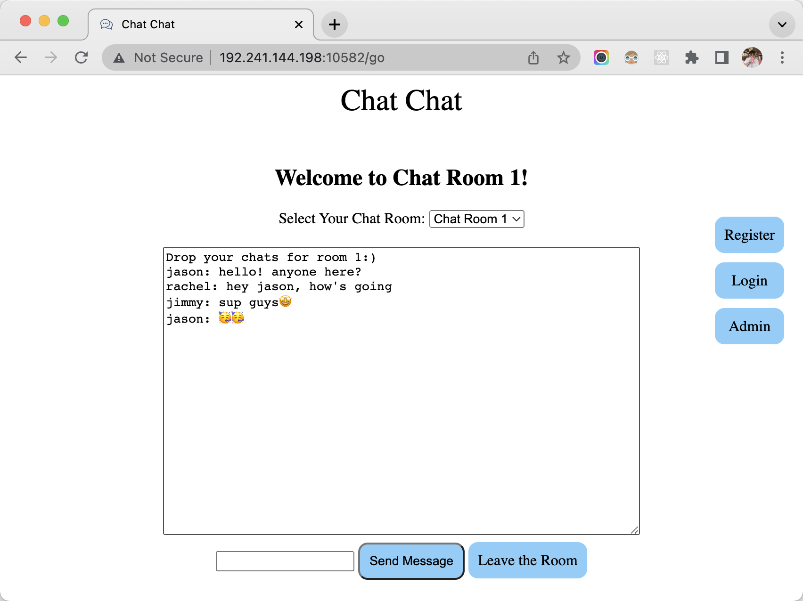
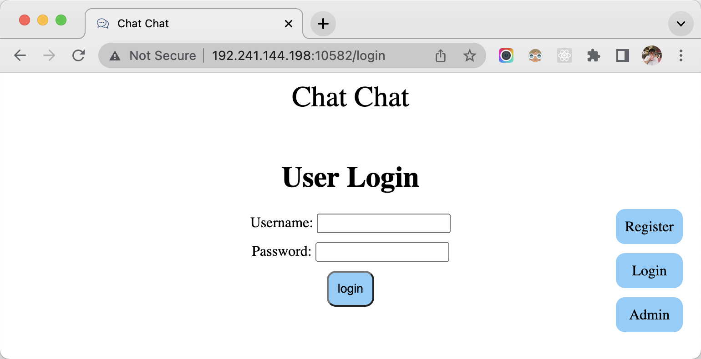
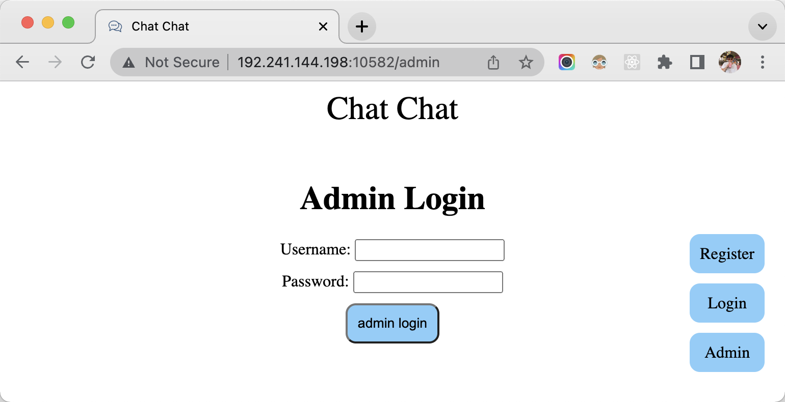

# Chat Chat

## Link to Chat Chat Live on the Web
[Chat Chat](http://192.241.144.198:10582/)

## Overview

Due to the negative impact brought by COVID-19, face-to-face communication becomes harder than ever before. For countries or regions that are severely affected by this contagious disease, it is no longer easy to simply head outside the door and meet with the one you want to see. Therefore, trying to find an effective way to communicate with others is key, and that is where Chat Chat comes in!

Chat Chat is a web app that allows users around the globe to “meet” and chat with each other. Within different chat rooms, users can chat about topics or issues that interest them the most: study, social issue, some nonsense, music, game, technology, arts … you name it. For new incoming users, they can register, login, and chat with other registered users on our site. But if someone does not want to register yet, that is also fine. They can enter and switch around between different chat rooms to see what others are talking about, but one limitation is that they will not be able to chat until they become registered users. In addition, there is going to be a system admin panel where authenticated admins can log in and manage all the chat rooms. Features include setting banned word list across the site and remove chat message from a specific chat room. 

## Data Model

The application will store Users, Admins, and Banned Words List

* users can have username and password
* admins can have admin name and admin password
* banned words list contains a list of strings where users across the chat rooms are not allowed to send to others

An Example User:

```javascript
{
  username: "jason",
  password: // password hash
}
```

An Example Admin:

```javascript
{
  adminName: "admin6699",
  adminPassword: // password hash
}
```

An Example Banned Words List:

```javascript
{
  wordList: ['apple', 'bag', 'cat', 'dog']
}
```

## [Link to Commented Schema](db.js)

Please click the above link to check out my schema.

## Wireframes

/ - homepage


/go - page for chatting



/register - page for creating a new user account


/login - page for user account authentication



/admin - page for logging in to the admin panel



/adminPanel - admin panel page


## Sitemap


## User Stories or Use Cases

1. as non-registered user, I can register a new user account with the site
2. as non-registered user, I can enter chat rooms and see what others are chatting about, but I am not allowed to chat
3. as non-registered user, I can switch between different chat rooms
4. as a user, I can chat with others within a chat room
5. as a user, I can switch between different chat rooms and chat with others
6. as an admin, I can login to the admin panel
7. as an admin, I can modify the banned words list within admin panel
8. as an admin, I can see each chat room's live chat messages and make changes to it

## Research Topics

* Perform server side form validation using custom JavaScript
    * see <code>http://192.241.144.198:10582/go</code>
    * if non-registered user tries to send a message, a warning message will appear in the DOM
    * if user tries to send empty message, a warning message will appear in the DOM
    * if user tries to send message containing banned words, those words will be replaced by ***
    * see <code>http://192.241.144.198:10582/adminPanel</code>
    * if anyone other than admin tries to access admin panel, an error message will appear in the DOM
    * only letters will be accepted as valid input when updating banned words list
    * see <code>http://192.241.144.198:10582/register</code>
    * if username contains non-alphanumeric values, a warning message will appear in the DOM
    * if credentials are missing, a warning message will appear in the DOM
    * if trying to register a duplicate account(e.g. same username), a warning message will appear in the DOM
* Integrate user authentication
    * see <code>http://192.241.144.198:10582/login</code> for user login page
    * see <code>http://192.241.144.198:10582/admin</code> for admin login page
    * will be using passport for user and admin authentication
    * if credentials are missing, a warning message will appear in the DOM
    * if username does not matched with credentials stored in DB, an error message will apear in the DOM
    * other errors occurred during login will also appear in the DOM

## [Link to Final Main Project File](app.js)

Please click the above link to check out my final app.js

## Annotations / References Used

1. [passport.js authentication docs](https://www.passportjs.org/docs/)
2. [get current path in js](https://stackoverflow.com/questions/3151436/how-can-i-get-the-current-directory-name-in-javascript/36420350)
3. [bring in jQuery library to carry out AJAX interactions](https://code.jquery.com/)
4. [triggering alert message for all kinds of activities](https://www.npmjs.com/package/js-alert)
5. [using passport's logout function](http://www.passportjs.org/docs/logout/)
6. [customize passport.js serialize & deserialize user functions based on different login scenarios](https://stackoverflow.com/questions/45897332/passport-js-multiple-de-serialize-methods)